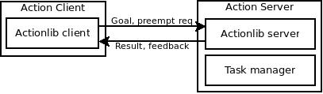

# Action Server

The Action Server is an actionlib server for managing the execution of high level tasks and their semantic chaining.
It takes actionlib goals describing series of high level tasks in json form, checks the consistency of the semantics, and executes them.
This readme starts by explaining how to implement your own Action, as most people will find this most relevant.
For some more background, read on after that, to learn about the architecture of the Action Server, the procedure of handling a goal and the lifecycle of an action.

You should already know about [ROS](http://wiki.ros.org/ROS/Tutorials), specifically [actionlib](http://wiki.ros.org/actionlib_tutorials/Tutorials), and a bit of [json](https://en.wikipedia.org/wiki/JSON).
You should also know about the [robot skills](https://github.com/tue-robotics/tue_robocup/tree/master/robot_skills) and [robot_smach_states](https://github.com/tue-robotics/tue_robocup/tree/master/robot_smach_states).

## Implementing your own Action
Basic steps for implementing an action are as follows:
  - Create a class that inherits from the Action base class [here](action_server/src/action_server/actions):
    - implement the \_configure method
    - implement the \_start method
    - implement the \_cancel method
  - Add your new action to the actions module [here](action_server/src/action_server/actions/__init__.py).
  - Add a command resolving to the required semantics to the grammar you want to test your action with, and test your Action using the natural language console configured with that grammar.

For a detailed guide on the internals of an Action implementation and instructions on how to implement your own Action, take a look at the example implementation: `example_action`.
This contains a lot of documentation and explanation on the details of Actions.

## Architecture



The Action Server uses an actionlib interface for communication with its clients.
A client implementation is provided as abstraction from the raw actionlib client.
Current examples of clients to the Action Server are:
 - The GPSR challenge
 - The Natural Language Console

Consult one of these implementations, or the Client docstring for example usage of the Client class.

Aside from the actionlib SimpleActionServer, the Action Server holds an instance of the Task Manager.
As the name suggests, this is the component that does the actual managing of the task (including its subtasks) for us.

A Task contains a recipe for execution, which is a sequence of action names with their configurations.
The Task Manager collects the correct action implementations, configures them and executes them.
This process is explained in section Procedure.
Actions manage the semantics of the task, references from one subtask to another and reasoning about the ability of the robot to execute before starting the execution.
After this process is performed, they should rely on robot skills or robot smach states to execute the actual behavior by wrapping the relevant ones.

## Procedure

Let's see what happens when a client sends a goal to the Action Server in a little more detail.

### Client side

Let's assume our client takes the high level natural language task *"Go to the kitchen, find a coke, and bring it to me."*
With a good natural language parser, it can parse this to the following json object:
```json
{
  "actions" :
  [
    {
      "action": "navigate-to",
      "object":
      {
        "type" : "room",
        "name" : "kitchen"
      }
    },
    {
      "action": "find",
      "object":
      {
        "type": "coke"
      }
    },
    {
      "action": "bring",
      "object":
      {
        "type": "reference"
      },
      "target-location":
      {
        "type": "person",
        "id": "operator"
      }
    }
  ]
}
```
This json object (the task recipe) can be sent to the Action Server.
While the server is working on the task, the client receives feedback when a new Action is started.
The client can cancel the running task Server.

### Server side

#### Configuration

The server parses the object and passes the resulting Python dictionary (the `recipe`) to the Task Manager (`set_up_state_machine(recipe)`).
The Task Manager then goes through the list of actions, instantiates actions and tries to chain their semantics.
It does this by calling the `configure` method on every action.

For example, the second action (*find a coke*) results in knowledge of a coke.
We don't know anything about this object yet, but we expect that there will be a coke in the world model.
This knowledge is part of the `ConfigurationResult` returned by `Find.configure(configuration_data)`.
It is added as knowledge to the configuration data that is passed to the next action.
The next action, (*bring it to me*), receives this knowledge, but does not necessarily need it.
However, the `reference` (*it*) in the `bring` action configuration data lets the `bring` action know that there must be knowledge of an object that can be brought somewhere.
Therefore, it will try to find this in the knowledge in its configuration data.
In our example, this knowledge is available, so the `bring` action will grab the found coke and take it to the operator.
When the required knowledge is not available, the action may return a ConfigurationResult specifying that information is missing.
The server will notify the client of this result so that it can ask the user for more information.

#### Execution

When all actions are successfully configured, the Task Manager is ready to start executing the actions.
To do this, the Action Server calls `task_manager.execute_next_action()` while there are still remaining actions.
It will return early if an action fails.
In our example: if the `find` action fails (so no coke is found), the `bring` action will not be executed.

## The Action life cycle

The Action life cycle consists of the following phases:
 - Instantiation:
    - initializing member variables (explained further in `example_action`):
      - `_config_result`
      - `_execute_result`
      - `_required_field_prompts`
      - `_required_passed_knowledge`
      - `_required_skills`
      - `_knowledge`
    - the Action's implementation may add checks for static resources. E.g.
      - knowledge availability
      - server availability
      - etc.
 - Configuration
    - checking task semantics using `_required_field_prompts`
    - checking passed knowledge using using `_required_passed_knowledge`
    - checking robot for required skills using `_required_skills`
    - calling the implementation's `_configure`
 - Execution
    - performing the actual action

## FAQ

 - **Why json?**
   - I know, it hurts to put a [json](https://en.wikipedia.org/wiki/JSON) string in a ROS message.
   But every action has its own semantics, its own parameters and its own structure in these parameters.
   This means it doesn't fit in a static ROS message a client can send to the Action Server.
   The easiest way to gain this flexibility is to use nested dicts and lists, i.e. json. For further reading on this, refer to #23.
