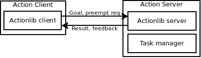

# Action Server

[](https://github.com/tue-robotics/action_server/actions/workflows/main.yml)

The Action Server is an actionlib server for managing the execution of high level tasks and their semantic chaining.
It takes actionlib goals describing series of high level tasks in json form, checks the consistency of the semantics, and executes them.
This readme starts by explaining how to implement your own Action, as most people will find this most relevant.
For some more background, read on after that, to learn about the architecture of the Action Server, the procedure of handling a goal and the lifecycle of an action.

You should already know about [ROS](http://wiki.ros.org/ROS/Tutorials), specifically [actionlib](http://wiki.ros.org/actionlib_tutorials/Tutorials), and a bit of [json](https://en.wikipedia.org/wiki/JSON).
You should also know about the [robot skills](https://github.com/tue-robotics/tue_robocup/tree/master/robot_skills) and [robot_smach_states](https://github.com/tue-robotics/tue_robocup/tree/master/robot_smach_states).

## Implementing your own Action
Basic steps for implementing an action are as follows:
  - Create a class that inherits from the Action base class [here](action_server/src/action_server/actions):
    - implement the \_configure method
    - implement the \_start method
    - implement the \_cancel method
  - Add your new action to the actions module [here](action_server/src/action_server/actions/__init__.py).
  - Add a command resolving to the required semantics to the grammar you want to test your action with, and test your Action using the natural language console configured with that grammar.

For a detailed guide on the internals of an Action implementation and instructions on how to implement your own Action, take a look at the example implementation: `example_action`.
This contains a lot of documentation and explanation on the details of Actions.

## Architecture



The Action Server uses an actionlib interface for communication with its clients.
A client implementation is provided as abstraction from the raw actionlib client.
Current examples of clients to the Action Server are:
 - The GPSR challenge
 - The Natural Language Console

Consult one of these implementations, or the Client docstring for example usage of the Client class.

Aside from the actionlib SimpleActionServer, the Action Server holds an instance of the Task Manager.
As the name suggests, this is the component that does the actual managing of the task (including its subtasks) for us.

A Task contains a recipe for execution, which is a sequence of action names with their configurations.
The Task Manager collects the correct action implementations, configures them and executes them.
This process is explained in section Procedure.
Actions manage the semantics of the task, references from one subtask to another and reasoning about the ability of the robot to execute before starting the execution.
After this process is performed, they should rely on robot skills or robot smach states to execute the actual behavior by wrapping the relevant ones.

## Procedure

Let's see what happens when a client sends a goal to the Action Server in a little more detail.

### Client side

Let's assume our client takes the high level natural language task *"Go to the kitchen, find a coke, and bring it to me."*
With a good natural language parser, it can parse this to the following json object:
```json
{
  "actions" :
  [
    {
      "action": "navigate-to",
      "object":
      {
        "type" : "room",
        "name" : "kitchen"
      }
    },
    {
      "action": "find",
      "object":
      {
        "type": "coke"
      }
    },
    {
      "action": "bring",
      "object":
      {
        "type": "reference"
      },
      "target-location":
      {
        "type": "person",
        "id": "operator"
      }
    }
  ]
}
```
This json object (the task recipe) can be sent to the Action Server.
While the server is working on the task, the client receives feedback when a new Action is started.
The client can cancel the running task Server.

### Server side

#### Configuration

The server parses the object and passes the resulting Python dictionary (the `recipe`) to the Task Manager (`set_up_state_machine(recipe)`).
The Task Manager then goes through the list of actions, instantiates actions and tries to chain their semantics.
It does this by calling the `configure` method on every action.

For example, the second action (*find a coke*) results in knowledge of a coke.
We don't know anything about this object yet, but we expect that there will be a coke in the world model.
This knowledge is part of the `ConfigurationResult` returned by `Find.configure(configuration_data)`.
It is added as knowledge to the configuration data that is passed to the next action.
The next action, (*bring it to me*), receives this knowledge, but does not necessarily need it.
However, the `reference` (*it*) in the `bring` action configuration data lets the `bring` action know that there must be knowledge of an object that can be brought somewhere.
Therefore, it will try to find this in the knowledge in its configuration data.
In our example, this knowledge is available, so the `bring` action will grab the found coke and take it to the operator.
When the required knowledge is not available, the action may return a ConfigurationResult specifying that information is missing.
The server will notify the client of this result so that it can ask the user for more information.

#### Execution

When all actions are successfully configured, the Task Manager is ready to start executing the actions.
To do this, the Action Server calls `task_manager.execute_next_action()` while there are still remaining actions.
It will return early if an action fails.
In our example: if the `find` action fails (so no coke is found), the `bring` action will not be executed.

## The Action life cycle

The Action life cycle consists of the following phases:
 - Instantiation:
    - the Action's implementation may add checks for static resources. E.g.
      - common (or challenge) knowledge availability
 - Configuration
    - sanity checking task semantics
    - checking knowledge passed from the previous to the current Action
    - availability of the interfaces required for executing the behavior
      - robot skills
      - (actionlib) servers
 - Execution
    - performing the actual behavior
    - checking the result and returning appropriate information

## VLA integration

The action server can run the HSR manipulation VLA in-process while retaining
the existing actionlib API. The public endpoint remains:

```text
/hero/action_server/task
```

The VLA implementation is layered as follows:

- `action_server/src/action_server/vla/executor.py` selects `classic`,
  `hybrid`, or `vla` execution.
- `action_server/src/action_server/vla/backends.py` provides the HSR
  observation, inference, and actuation backend.
- `per-group-mse-vla/inference/policy_server.py` loads the checkpoint and its
  LeRobot preprocessor/postprocessor files.

The shared ROS launch entry point is
`hero_bringup/launch/action_server.launch`. It owns `execution_mode` and
`checkpoint_path`, loads
`hero_bringup/parameters/action_server/vla.yaml`, and starts `main.py`.
`hero-free-mode` already includes this launch, so do not start a second action
server afterward.

Start the classic path:

```bash
hero-start
hero-free-mode
```

The action-server launch adds the policy repository to the ROS node's
`PYTHONPATH`. In the container architecture, ROS Python 3.8 does not import
LeRobot; it only needs the lightweight WebSocket client packages:

```bash
python -m pip install -r action_server/requirements-vla.txt
```

### Test the policy without ROS or GPSR

Build the Python 3.12 policy image from the `per-group-mse-vla` repository:

```bash
cd /home/amigo/ros/noetic/repos/github.com/tue-robotics/per-group-mse-vla
docker build -f inference/Dockerfile -t smolvla-policy-server .
```

Run the direct checkpoint test:

```bash
docker run --rm --gpus all \
  -v /home/amigo/.cache/huggingface/hub/models--PauMontagut--per-group-mse-smolvla:/model-cache:ro \
  smolvla-policy-server \
  python /opt/policy/local_smoke_test.py \
  --checkpoint /model-cache/snapshots/cb72ca6a3a58e724a3ca8579bea3811f1810be96
```

The test is successful when it prints:

```text
actions_shape=(50, 11)
finite=True
PASS: checkpoint inference is ready for the WebSocket policy server
```

This validates CUDA, checkpoint loading, preprocessing, state selection, and
one action prediction. It does not use ROS cameras or move the robot.

### Run the policy server for hybrid execution

Leave this command running in its own terminal. Mount the complete Hugging
Face cache because snapshot files link to the cache's `blobs` directory:

```bash
docker run --rm --gpus all \
  -v /home/amigo/.cache/huggingface:/root/.cache/huggingface \
  -v /home/amigo/.cache/huggingface/hub/models--PauMontagut--per-group-mse-smolvla:/model-cache:ro \
  -e POLICY_CHECKPOINT_PATH=/model-cache/snapshots/cb72ca6a3a58e724a3ca8579bea3811f1810be96 \
  -p 8000:8000 \
  smolvla-policy-server
```

Wait for these logs before starting ROS:

```text
Policy server ready on cuda
Listening on ws://0.0.0.0:8000
```

### Classic mode

Classic mode does not contact the policy server:

```bash
hero-start
hero-free-mode
```

### Hybrid mode

Start ROS in another terminal after the policy server is listening:

```bash
hero-start
export ACTION_SERVER_EXECUTION_MODE=hybrid
export ACTION_SERVER_CHECKPOINT_PATH=/home/amigo/.cache/huggingface/hub/models--PauMontagut--per-group-mse-smolvla/snapshots/cb72ca6a3a58e724a3ca8579bea3811f1810be96
hero-free-mode
rosparam set /hero/action_server/vla/policy_url ws://127.0.0.1:8001
rosparam get /hero/action_server/vla/policy_url
```

The ROS backend connects to `ws://127.0.0.1:8000`, configured as
`policy_url` in `hero_bringup/parameters/action_server/vla.yaml`. Confirm the
mode and endpoint:

```bash
rosparam get /hero/action_server/vla/execution_mode
rosnode info /hero/action_server
rostopic list | grep /hero/action_server/task
```

For a successful hybrid request, the policy terminal prints:

```text
Client connected from ...
Inference OK, chunk shape (50, 11), ... ms
```

The action-server terminal prints `[VLA] Connected to policy server at ...`.
If VLA execution fails in hybrid mode, the action server logs
`Provider returned failure, using classic fallback` and continues with the
classic implementation.

Before GPSR, verify that the action server is alive:

```bash
rosnode info /hero/action_server
rostopic list | grep /hero/action_server/task
rosparam get /hero/action_server/vla/execution_mode
```

Then run the GPSR test:

```bash
rosrun challenge_gpsr gpsr.py _robot_name:=hero _test_mode:=true _skip:=true
rosnode kill /hero/hmi/random_answerer
rostopic pub /hero/hmi/string std_msgs/String \
    "data: 'get the apple from the dining table'" --once
```

If GPSR reports `Waiting for task action server to come online...`, the action
server node is absent or failed during startup. Inspect its terminal for
`main.py` installation errors, robot initialization failures, or missing Python
dependencies before investigating the VLA. In hybrid mode, a message such as
`Local backend call failed: No module named 'lerobot'` means the action server
is alive and has reached the VLA backend, but the model runtime is unavailable;
hybrid mode will intentionally fall back to classic execution.

The released checkpoint is `PauMontagut/per-group-mse-smolvla` on Hugging Face.
Its six state values are mapped from the HSR arm joints and gripper through
`state_indices: [0, 1, 2, 3, 4, 5]` in the VLA YAML. Modern checkpoints define
their own state/action dimensions and preprocessing pipelines; older
checkpoints use the loader's legacy normalization fallback.

## FAQ

 - **Why json?**
   - I know, it hurts to put a [json](https://en.wikipedia.org/wiki/JSON) string in a ROS message.
   But every action has its own semantics, its own parameters and its own structure in these parameters.
   This means it doesn't fit in a static ROS message a client can send to the Action Server.
   The easiest way to gain this flexibility is to use nested dicts and lists, i.e. json. For further reading on this, refer to #23.

next AI bug to send from last gprs run:
2026-09-11 22:18:59,062 [INFO] policy_server Policy server ready on cuda with policy=smolvla state_dim=6 action_dim=11
2026-09-11 22:18:59,081 [INFO] websockets.server server listening on 0.0.0.0:8000
2026-09-11 22:18:59,081 [INFO] policy_server Listening on ws://0.0.0.0:8000
2026-09-11 22:19:57,199 [INFO] websockets.server connection open
2026-09-11 22:19:57,199 [INFO] policy_server Client connected from ('172.17.0.1', 57470)
Loading  HuggingFaceTB/SmolVLM2-500M-Video-Instruct weights ...
Reducing the number of VLM layers to 16 ...
Loading weights from local directory

[WARN] [1789165197.214603, 181.083000]: [VLA] Provider returned failure, using classic fallback: Local backend call failed: 'float' object cannot be interpreted as an integer : 257

again..
